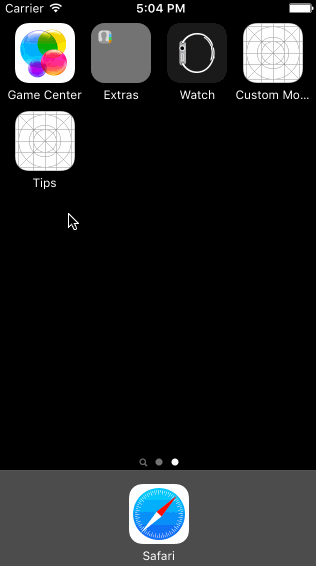

# Pre-work - *Tips Calculator*

**Tips Calculator** is a tip calculator application for iOS.

Submitted by: **Dong Tan Huy**

Time spent: **20** hours spent in total

The following **required** functionality is complete:

* [X] User can enter a bill amount, choose a tip percentage, and see the tip and total values.
* [X] Settings page to change the default tip percentage.

The following **optional** features are implemented:
* [X] UI animations
* [X] Remembering the bill amount across app restarts (if <10mins)
* [X] Using locale-specific currency and currency thousands separators.
* [X] Making sure the keyboard is always visible and the bill amount is always the first responder. This way the user doesn't have to tap anywhere to use this app. Just launch the app and start typing.

## Video Walkthrough 
Here's a walkthrough of implemented user stories:

GIF created with [LiceCap](http://www.cockos.com/licecap/).
